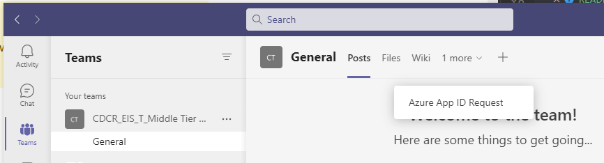
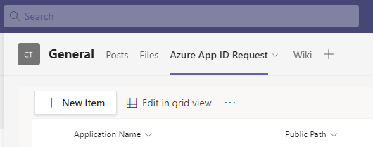
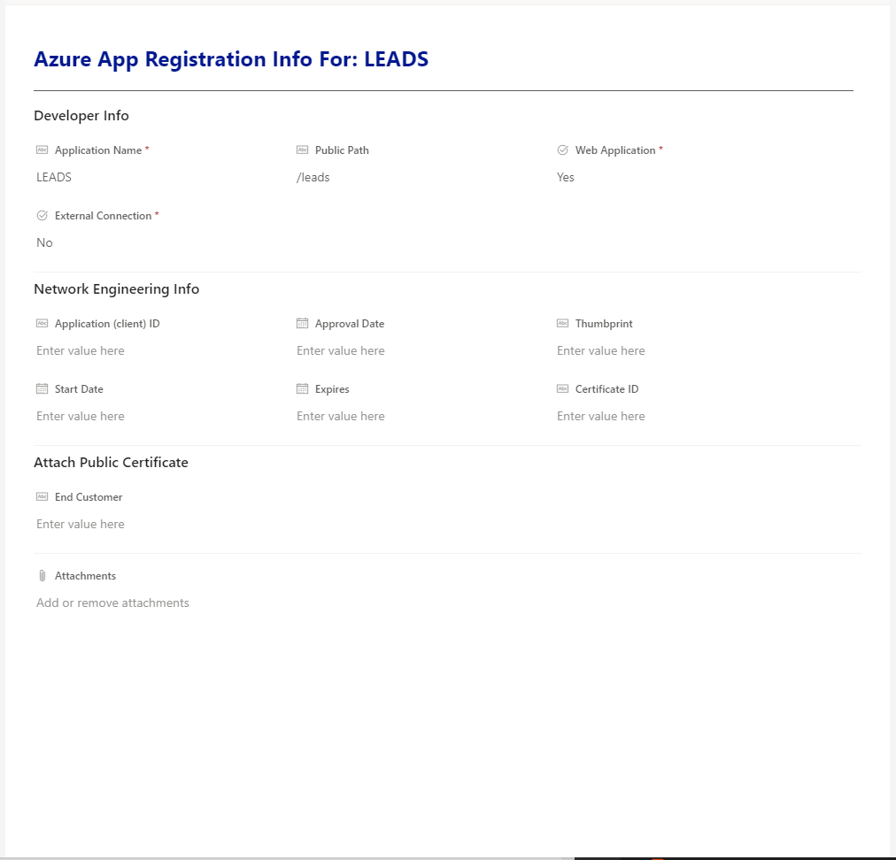
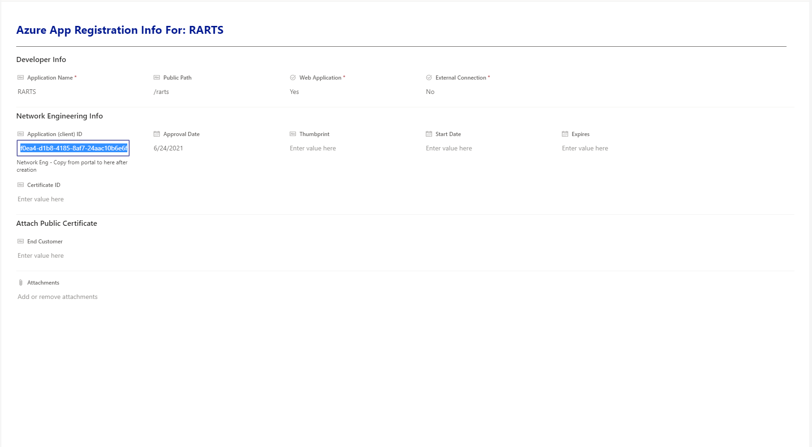
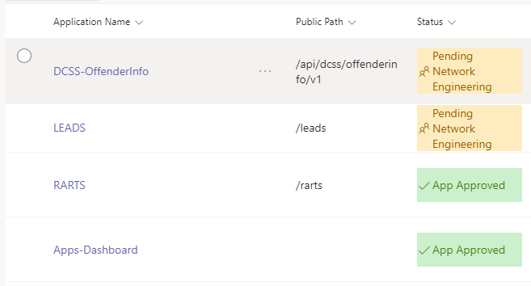

# :keyboard: Registering your application

:::danger
This process is in it's **alpha** stage and may change upon release.
:::

:::danger
This process is no longer to be used as of **08/31/2021**. Stay tuned..
:::

**Two things** are required for every application that are defined in `package.json`:

### azureAppID

::: warning
The default value must not be used for production. Follow the guide to register one for your app.
:::

- **Type:** `String`
- **Default:** `c0cf535a-bb4d-4731-94fb-8a4165b1a124`
- **Read-Only:** `false`
- **Usage:**\
   You can find `this.$myApp.azureAppID` defined in the `package.json` file.

### publicPath

::: warning
The default value must not be used for production. Follow the guide to register one for your app.
:::

- **Type:** `String`
- **Default:** `/app`
- **Read-Only:** `false`
- **Usage:**\
   You can find `this.$myApp.publicPath` defined in the `package.json` file.

## :page_facing_up: Fill in the Request form

The form to register your `azureAppID` and `publicPath` can be found in **Microsoft Teams** under the team `CDCR_EIS_T_Middle Tier PWA`.

1. Go to the General section under the `CDCR_EIS_T_Middle Tier PWA Team` team
2. Open the `Azure App ID Request` form under General.\
   _On smaller devices, the `Azure App ID Request` item may be hidden under more._
   

3. Click `+ New Item`\
   

4. Fill in the form\
   Below is an example of a completely filled out form.
   Once this has been submitted the submitter will receive an email.
   
   

## :incoming_envelope: Submit a remedy ticket

:::tip
Instructions on submitting your remedy ticket can be found [here](http://intranet/Remedy/Shared%20Documents/User%20Guides/User%20Guides%20for%20IT%20Support/ROD%20-%20How%20to%20Create%20an%20Incident%20-%20v6.pdf)
:::

Use the e-mail received to process your remedy request [here](https://cdcr.us.onbmc.com/)\

## :smiley: App Approved

**When you're application is approved you should receive an e-mail with your `azureAppID` attached.**

_If_ for some reason you don't receive an e-mail you'll find your form in **Microsoft Teams** has been updated.
Clicking the form in **Microsoft Teams** will reveal the `azureAppID`

- Below is an example of a completed form for the _RARTS_ application.
  
  _For your form, you'll use the value in `Application (client) ID` as your `azureAppID`_

## :ballot_box_with_check: Apply your changes

:::tip
:calendar: Application Approvals generally have a turn around time of 3 weeks.
:::

When your form is approved in **Microsoft Teams**, it will go from `Pending Networking Engineering` to `App Approved`.
Opening the form will reveal your new `azureAppID`.

_You can now navigate to `package.json` and update the fields `azureAppID` and `publicPath`._ :clap:

## Resources

[Remedy Portal](https://cdcr.us.onbmc.com/)

[Remedy Instructions](http://intranet/Remedy/Shared%20Documents/User%20Guides/User%20Guides%20for%20IT%20Support/ROD%20-%20How%20to%20Create%20an%20Incident%20-%20v6.pdf)
