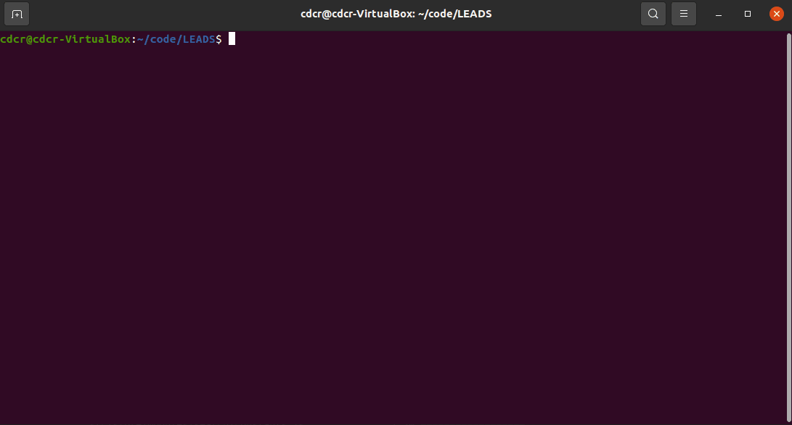
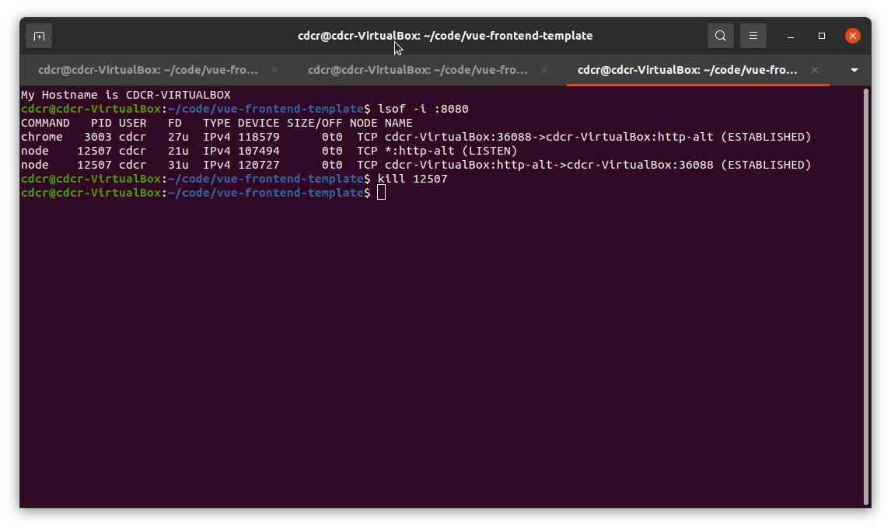

# :question: FAQ

## How to merge my changes with main?

A fail safe way to walk your changes on top of main is to run the command:

```sh
npm run merge-squash
```



You can check out the full details here
::: details
<<< @/../scripts/merge_squash.sh
:::

## How to debug the application from my phone?

::: tip
PLEASE read carefully the first time around.</br>
Once you've set it up, you don't have to do it again!
:::

### Pre-requisites

- [ ] Mobile android device :iphone:
- [ ] Wifi Connection :signal_strength:
- [ ] USB Cable :electric_plug:

### Enable Port Forwarding in your browser

::: tip
You'll need to do this in both your VM and work machine.
:::

- [ ] Navigate to `chrome://inspect/#devices`
- [ ] Enabled `Discover USB device`
- [ ] Enable Port forwarding

### Enable USB Debugging

- [ ] On your device go to `Settings > About Phone > Build Number`
- [ ] Tap Build Number continuosly until you see the countdown `'You are now a developer'`
- [ ] Developer options should now be visible under Settings
- [ ] Go to Developer options and turn on USB Debugging
- [ ] Plug in your USB cable into your machine and mobile device
- [ ] It will prompt to allow USB Debugging
- [ ] Navigate to `localhost:8080/<APP_NAME>` on your mobile device
- [ ] Done.

Your settings should look similar to below:


## When to Fork vs Clone?

- **Fork** - when you're creating a project in devops for the first time.

- **Clone** - when you're pulling down the project you just forked in devops to your local machine.
  - Because a `git clone` does not bring down any upstream branches, git will tell you to run the command below:

```
git remote add upstream https://cdcr@dev.azure.com/cdcr/CDCR-EIS-MiddleTier-Templates/_git/vue-frontend-template
```

## What's the difference between a git `clone` and `fork`.

Creating a fork will link your newly created repository and the repository you forked from.

- The benefit to this is when creating a `Pull Request`, devops is smart enough to your repository was forked.
  - This allows you to pull in changes bi-directionally.
  - This is great for pulling in updates.

```
git remote add upstream https://cdcr@dev.azure.com/cdcr/CDCR-EIS-MiddleTier-Templates/_git/vue-frontend-template
```

Doing a `git clone https://...` of a project will only provide you a copy.

- This is great for testing or working on a project.
- Does not bring in any remote upstreams
- If the project is forked, `git clone` will give you the command to add it if available.

## How to update template version?

```sh
# 1. Check that you don't already have an upstream remote pointing to:
# https://cdcr@dev.azure.com/cdcr/CDCR-EIS-MiddleTier-Templates/_git/vue-frontend-template
git remote -v

# 2. Add it otherwise
git remote add upstream https://cdcr@dev.azure.com/cdcr/CDCR-EIS-MiddleTier-Templates/_git/vue-frontend-template

# 3. Merge in changes from vue-frontend-template.
git fetch upstream main
git merge --squash upstream/main # Resolve any merge conflicts
```

#### Tips:

- Use `git fetch upstream main` to check for updates.
- Select the **Accept all incoming.** option when dealing with merge conflicts in `@/config/private/`.
- All other merge conflicts should be handled normally.

## How to update app version?

You can properly update your application `major`, `minor`, and `patch` releases with **npm** provided commands.

- This bumps up the version appropriate
- Creates a commit on your current branch with the version number
- Creates a tag _(Not needed)_

* **Type:** `CLI`
* **Usage:**

```sh
# Assume we're currently on version 1.0.1

npm version major # Sets the version to v2.0.0
npm version minor # Sets the version to v1.1.0
npm version major # Sets the version to v1.0.2
```

## Why am I getting errors from `api/auth/v1/authentication`

_Assuming you're on your local machine..._

Make sure you have the MT server running and try again.

```sh
# Navigate to your database-template
cd ~/code/database-template
git pull
npm install
./scripts/start_test_servers.sh
npm run dev
```

_If this is the first time you're running the MT server..._

- [ ] Connect to F5
- [ ] Bring down the latest images from database-template

```sh
./scripts/get_test_images.sh
```

- [ ] Try running it again

```sh
./scripts/start_test_servers.sh
npm run dev
```

_If you've recently lost connection to F5_

You'll need to do a fast restart of your servers.

- [ ] Run the fast restart script in your server directory

```sh
./scripts/fast_restart.sh
```

## Why does the app name in the browser title show up with delimitters?

This is because of the following code in `/public/index.html`

Webpack automatically pulls the title from the variable `name` in `package.json`.

```html
<!DOCTYPE html>
<html lang="en">
  <head>
    ...
    <title><%= htmlWebpackPlugin.options.title %></title>
    ...
  </head>
</html>
```

If you want to correct this without the delimitters you can hard code it like so:

```html
<title>My App Name</title>
```

## How can I access my Vue app through console?

By default the Vue application is mounted to an element with the id app.

- [ ] Open DevTools with `Ctrl + Shift + I`
      In the prompt you can create a variable and assign it to app.

```javascript
const app = document.getElementById('app').__vue__;
app.$store.set('app/loading', true);
app.$store.set('app/loading', false);
```

:::tip
You actually have access to the store already in the dev tools.
:::

```js
store.set('app/loading', true);
store.set('app/loading', false);
```

## Why does my application run on PORT 8081?

This is likely because you also have another application running in the backround.
Look for a open terminal and make sure they are not running the web server already. (Remember to check VS Code)

If that doesn't work you can kill the pid after looking for it with the following command:

```sh
lsof -i :8080 # Look for the PID
kill <PID>
```


