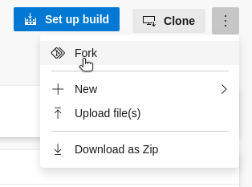
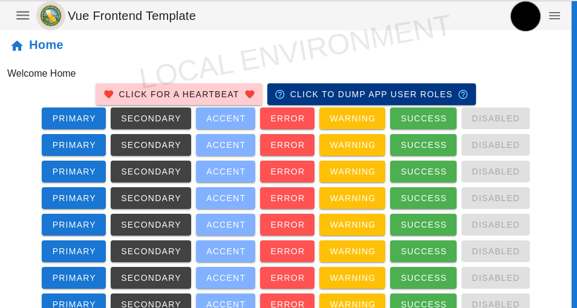
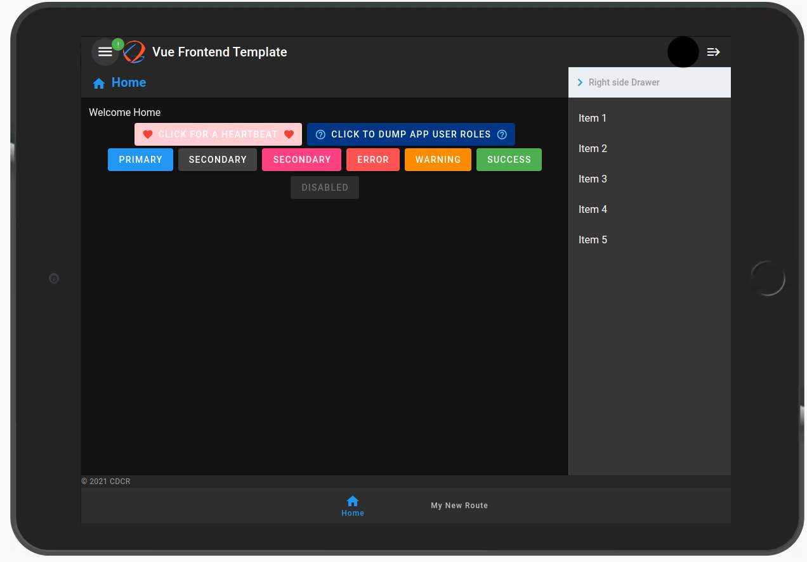
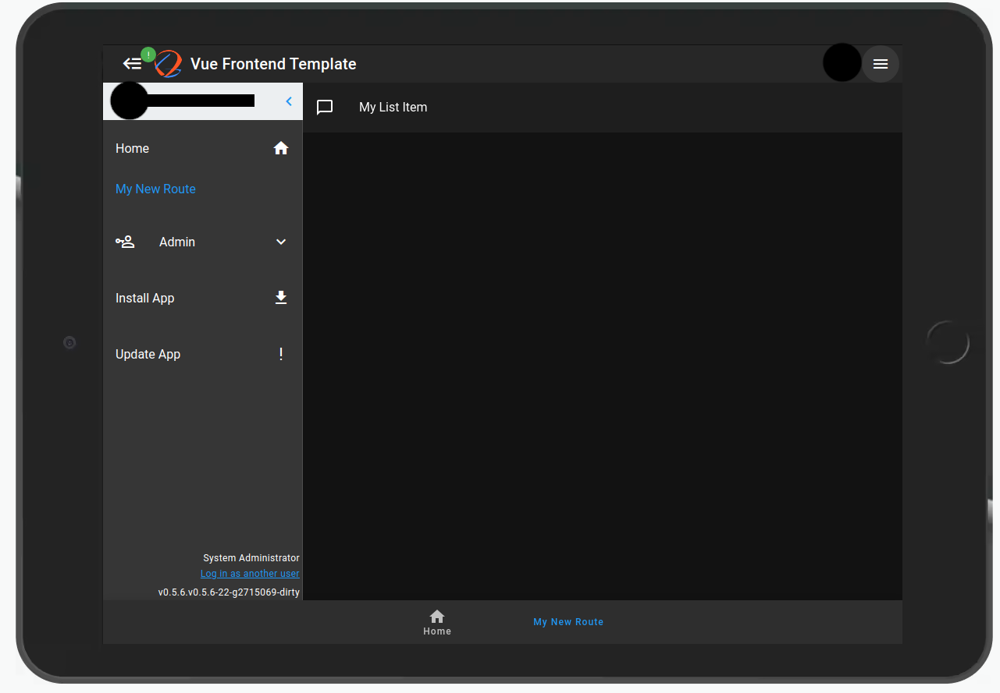
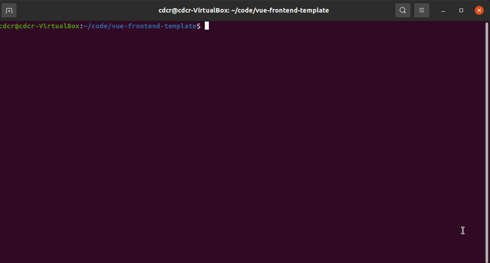
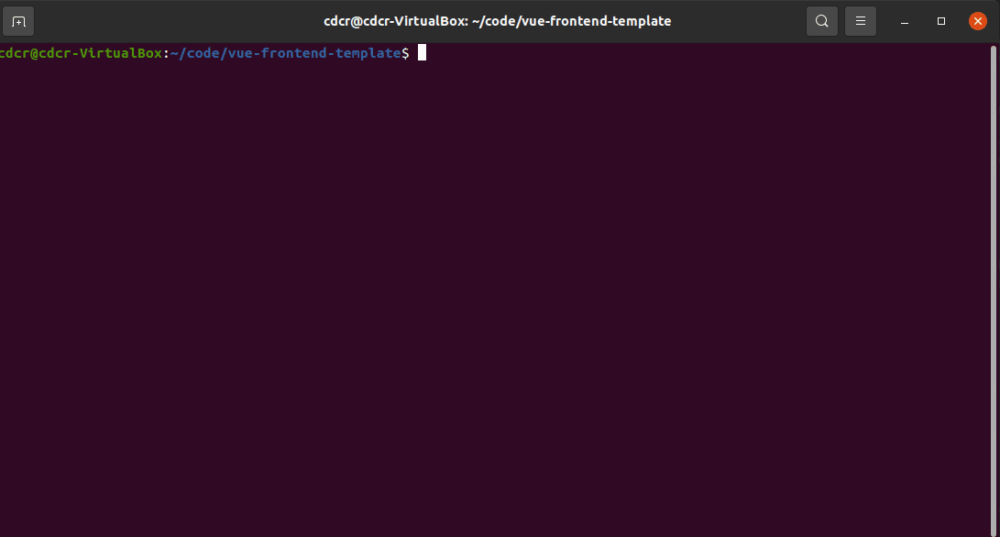

# :school: Introduction

**This guide will walk you through the following:**

- :heart_eyes_cat: Starting a **new project** from scratch
- :name_badge: Adding the **project name** to the app
- :rainbow: Adding **color** to the app
- :black_flag: Adding the application **logo**
- :stop_sign: Pausing to **push and commit** your changes
- :oncoming_taxi: Using **Vue Router**
- :ledger: Using **Vuex** for state management
- :desktop_computer: Using the **Middle Tier**

By the end of this is, _my goal_ is to get you comfortable enough to start solving the real business problems on your own.

## :heart_eyes_cat: Starting a **new project** from scratch

1. Visit the [URL](https://dev.azure.com/cdcr/CDCR-EIS-MiddleTier-Templates/_git/vue-frontend-template)
2. Click the Vertical Elipsis on the page to bring up the `Fork` option.
   
3. After forking the template, clone it from your project.

_Below shows an example for the **LEADS** repository in the **Parole LEADS** project_

```sh
git clone https://cdcr@dev.azure.com/cdcr/Parole%20LEADS/_git/LEADS
cd LEADS
npm install # install any package.json dependencies
npm run start-servers # Start the local mt backend with the start-servers script in package.json
npm run serve # Start the local frontend webserver with the serve script in package.json
```

## :name_badge: Adding the **project name** to the app

- [ ] Change your `name` in `package.json`

Check out the [Config section](/config/#name) to learn more

- By default the `name` as it's shown in your application is derived from `package.json`
- `package.json` has a boundary requiring the `name` to pass the following [regex](https://regex101.com/r/hFKllG/1):

```
^(?:@[a-z0-9-*~][a-z0-9-*._~]*/)?[a-z0-9-~][a-z0-9-._~]*$
```

- [ ] Change **vue-frontend-template** in `README.md` to your project name.
- **Usage:**

```javascript
// Access it in a `.vue` file with `this.$myApp` or import in another `.js` file
import myApp from '@/config/myApp.js';
console.log('myApp: ', myApp.name);
```

## :rainbow: Adding **color** to the app

### Modifying the theme colors

Light and Dark themes are derived from the file `"@/plugins/themes.js"`

- [ ] Change the `primary,secondary,accent,error,info,success and warning` colors as needed.

- If you want to change the bar colors, you can do so in: _(Just remember to check font colors too)_
  - `@/components/layouts/navigation/AppBar.vue`
  - `@/components/layouts/navigation/BottomNavBar.vue`
  - `@/components/layouts/navigation/NavDrawerLeft.vue`
  - `@/components/layouts/navigation/NavDrawerRight.vue`

:::details
<<< @/../src/plugins/themes.js
:::

NOTE: _Remember to see what it also looks like in dark mode before settling on a theme._

### Updating the scrollbar colors

By default when the page needs to scroll, the scrollbar color is defaulted to the primary color defined in `@/plugins/themes.js`.



## :black_flag: Adding the application **logo**

- [ ] _If you have one_, add your logo to the app with the following script:

```sh
# This script takes in a single argument pointing to your .svg or .png file.
# A backup of your old public/img/icons folder is created.
# The final product is an updated public/img/icons folder with all the appropriate sizes for PWA.
./scripts/image_resize.sh ~/Documents/Icons/logo.png
```

You should see a logo change after a refresh now.



## :stop_sign: Pausing to **push and commit** your changes

### Naming our working branch

When first starting off the `main` branch is checked out.
It's good practice to work in our own branch and not pollute `main`.

```sh
git checkout -b MyWorkingBranch
```

### Stage - Commit - Push

Now is a good time to `stage` all of our changes, give it a good `commit` message and `push` them to devops.

- [ ] Run the following in a terminal:

```sh
git commit -am "Updated application name, applied application themes, and added logo." # Give it a good commit message
git push # Push
```

We're ready to move on to the next steps! :checkered_flag:

## :oncoming_taxi: Using **Vue Router**

Vue Router is used for our navigation throughout the app. It can even handle an array of `children` within its [`RouterConfig`](/routing/#routeconfig-interface)!

### Create the component for your route

- [ ] Create a new `MyComponent.vue` file in `@/views/...`

```vue
<template>
  <v-list>
    <v-list-item
      ><v-list-item-action @click="sayHello()"
        ><v-icon>mdi-message-outline</v-icon></v-list-item-action
      >
      <v-list-item-content>{{ text }}</v-list-item-content>
    </v-list-item>
  </v-list>
</template>
<script>
  export default {
    name: 'MyComponent',
    data: () => ({
      text: 'My List Item',
    }),
    computed: {
      loading() {
        return this.$store.state.app.loading;
      },
    },
    methods: {
      sayHello() {
        this.$store.commit('app/SET_LOADING', true);

        setTimeout(() => {
          alert('Hello world!');
          this.$store.commit('app/SET_LOADING', false);
        }, 300);
      },
    },
  };
</script>
```

### Configure a route for your component

:::tip
It is recommened we lazy load our components with the `import(/*webpackChunkName: "..." */ '...')` statement.
:::
[Webpack](https://webpack.js.org/api/module-methods/#magic-comments)

- [ ] Navigate to `@/router/routes.js`
- [ ] Add your [`RouteConfig`](/routing/#routeconfig-interface) to the `routes` array.

```js
// "@/router/routes.js

const routes = [
  ...

  {
    name: 'My New Route',
    path: '/mynewroute',
    component: () =>
      import(/* webpackChunkName: "admin" */ '@/views/MyComponent.vue'),
  },

  ...
];
```

- [ ] Add your route to the Routed Items at the bottom for navigation.
      The default choices are shown below:

_Feel free to add your own `Items`, just remember to apply it to the `NavDrawerLeft.vue` component._
Read more on that at [routing/#routeconfig-interface](/routing/#navigation)

```js
// Routes used on AppBar.vue
const TopNavItems = getRoutesByName([
  // 'Home',
  // 'Settings',
  // 'Admin',
  // 'CDCR Dashboard',
  // 'Settings',
]);
// Routes used for the Toolbar in AppBar.vue
const ToolbarItems = getRoutesByName(['Home', 'Settings', 'CDCR Dashboard']);
// Routes fused for BottomNavBar.vue
const BottomNavItems = getRoutesByName(['Home', 'Admin']);
// Routes used for NavDrawerLeft.vue
const LeftNavItems = getRoutesByName(['Home', 'Admin', 'Settings']);
```

Navigate to your new page using the left navigation drawer!



## :ledger: Using **Vuex** for state management

`Vuex` is used for state management of our applications. This greatly reduces the need to pass `props` or `$emit` events that the parent/child listens for. `vuex-pathify` **greatly** reduces the boilerplate code around creating mutations.

### Helper vuex-pathify to access state

Update our `MyComponent.vue` file to utilize `vuex-pathify` instead.

```vue
<template>
  <v-list>
    <v-list-item
      ><v-list-item-action @click="sayHello()"
        ><v-icon>mdi-message-outline</v-icon></v-list-item-action
      >
      <v-list-item-content>{{ text }}</v-list-item-content>
    </v-list-item>
  </v-list>
</template>
<script>
  import { sync } from 'vuex-pathify';
  export default {
    name: 'MyComponent',
    data: () => ({
      text: 'My List Item',
    }),
    computed: {
      ...sync('app', ['loading']),
    },
    methods: {
      sayHello() {
        this.loading = true;

        setTimeout(() => {
          alert('Hello world!');
          this.loading = false;
        }, 300);
      },
    },
  };
</script>
```

Much less code to track! :nerd_face:

### Creating a Vuex Module

- [ ] `npm run new module`.



- [ ] Update the `getDefaultState` in `greetings.js` to be the following:

```js
const getDefaultState = () => {
  return {
    text: '',
  };
};
```

### Using your Vuex Module

In the component we created earlier, we can now pull in the greetings and update it with `vuex-pathify`!

Update your component to sync our state `text` from the `greetings` module.

```vue
<template>
  <v-list>
    <v-list-item
      ><v-list-item-action @click="sayHello()"
        ><v-icon>mdi-message-outline</v-icon></v-list-item-action
      >
      <v-list-item-content>{{ text }}</v-list-item-content>
    </v-list-item>
  </v-list>
</template>
<script>
  import { sync } from 'vuex-pathify';
  export default {
    name: 'MyComponent',
    data: () => ({}),
    computed: {
      ...sync('app', ['loading']),
      ...sync('greetings', ['text']),
    },
    methods: {
      sayHello() {
        this.loading = true;

        setTimeout(() => {
          this.text = 'Hello World!';
          this.loading = false;
        }, 300);
      },
    },
  };
</script>
```

### Persist your Vuex Module

- [ ] Add your `vuex module name` to the `modules` array in any of these files:
- `@/store/plugins/cookies.js`
- `@/store/plugins/indexedDB.js`
- `@/store/plugins/localStorage.js`\
  NOTE: _Only `indexedDB` is automatically encrypted by compression during production!_

```js
// @/store/plugins/indexedDB.js
const modules = ['users', 'greetings']; // TODO: Add any modules you want to save to persistence
```

Now when you refresh your page, your `text` does not go away.

## :desktop_computer: Using the Middle Tier

There are many connections made available to us by _The Great Sorcerers of the Middle Tier_.\
This guide aids you as an apprentice in the steps required to conjuring your own connections to different server realms such as `MongoDB, Mongoose, MSSQL, Oracle, POSTGRES and others...`

To keep the training simple, we will go over the steps for only `MongoDB and Mongoose`.

### Creating a MongoDB Service

- [ ] Navigate to the [database-template](https://dev.azure.com/cdcr/CDCR-EIS-MiddleTier-Templates/_git/database-template) repo.
  - [ ] Follow `Project Setup` section in the `README.md` file.
- [ ] Switch to the directory in VS Code.
- [ ] Name your MongoDB database in `config/default.json`
- [ ] Navigate to `service-config.js`, your `appPath, docsPath, server and services` section should be updated accordingly like below:

```javascript
// service.config.js

appPath: '/api/servername',
docsPath: '/docs/servername',
server: {
  ...
    mongooseEnabled: false,
    mongodbEnabled: true,
    mssqlEnabled: false,
    oracleEnabled: false,
    postgresEnabled: false,
  },
services: [
    {
      name: 'myservicename',
      version: 'v1',
      enabled: true,
      description: 'My First Service',
    },
]
```

- [ ] Copy the `src/services/mongodbservice_v1` folder
- [ ] Rename the folder and all associated files.

* It is important the folder and file names follow the same naming convention so they can map back to the `name` and `version` under `services` in `service-config.js`

- [ ] Update the `dbCollectionName` appropriately in the `<name>_<version>.class.js` file
- [ ] Move to the [Accessing your Feathers Service](#accessing-your-feathers-service) section to continue

### Accessing your Services

- [ ] Create a backend feathers service to hook into and call APIs with

- [ ] `npm run new service`



Use it like so in Vue

```javascript
import exampleService from "@/feathers/services/example/example.service.js";
async mounted() {
    this.myData = await exampleService.find({
        query: {
            stale: false,
            dataId: {
                $in: [ 1, 3, 4, 5]
            }
        }
    });
}
```

### Giving your application API permissions

- [ ] Visit http://localhost:3000

* This will take you to our local backend server.

- [ ] Click `Sign in to Azure`
- [ ] Click `Get MT Access Token`
- [ ] Give it your App ID
- [ ] Click `Get API Master List`

* A tree view should appear on the left with `auth` and `eis` unchecked.
  - Clicking either API endpoint will expand the tree.
  - This should be empty for your generated app id.

- [ ] Select the APIs that your application requires.
- Expand the API to see its `find`, `get`, `create`, `update`, `patch`, and `remove` permissions.
- [ ] Click `Update/Create API Permissions` to save changes.
- [ ] Refresh and sign back in to get a new token with your updated API permissions.

### Updating your application template

Add a remote called `upstream` that points to the forked repository.
You can then pull down the latest changes from the template like so.

```sh
git remote -v # Check that you don't already have it
git remote add upstream https://cdcr@dev.azure.com/cdcr/CDCR-EIS-MiddleTier-Templates/_git/vue-frontend-template
git fetch upstream main
git merge --squash upstream/main
```
