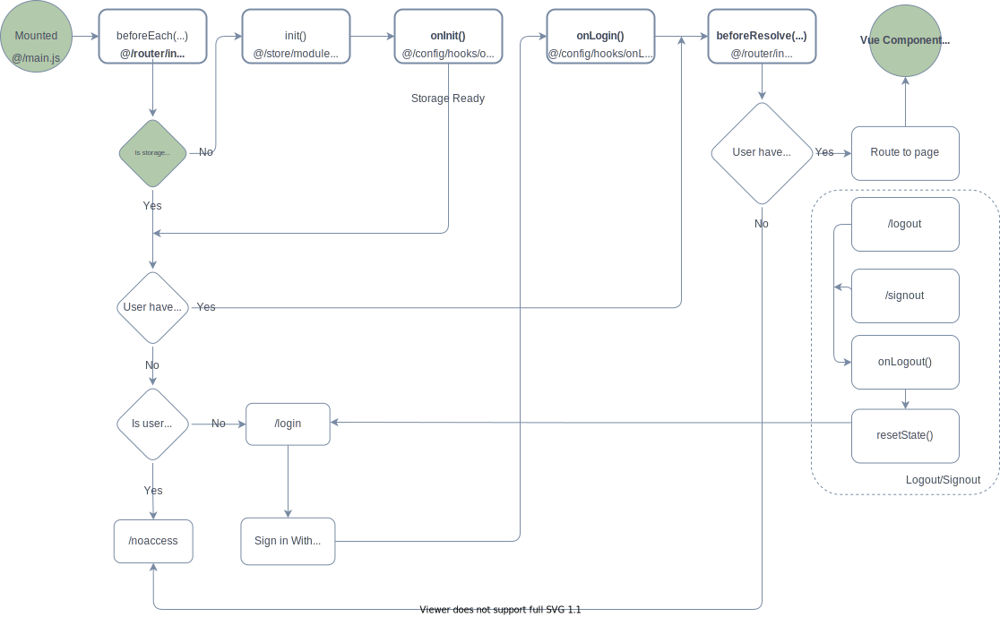

# Lifecycle Diagram

All of the hooks within the vuex frontent template can be found in `@/config/hooks/...`

The diagram below illustrates all of the hooks the frontend goes through before it reaches the Vue Component Lifecycle your application follows.

- onInit() - On refresh or during login
- - You can define your init() functions inside each vuex module.
- onLogin() - After user signs in with Microsoft but before routing to Home
- - Happens only AFTER the user explicitly logs in, not during a refresh of the browser
- resetState() - After authentication has been removed but before routing back to Login.
- - You can define your resetState functions inside each vuex module.
- onLogout() - Called after user has been routed to the Login page after clicking 'Logout'
