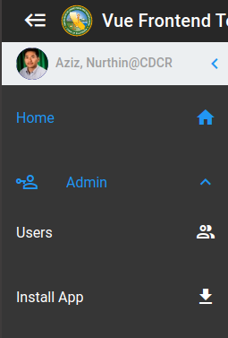
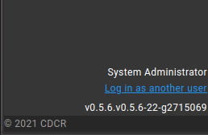
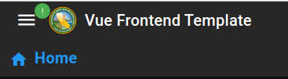
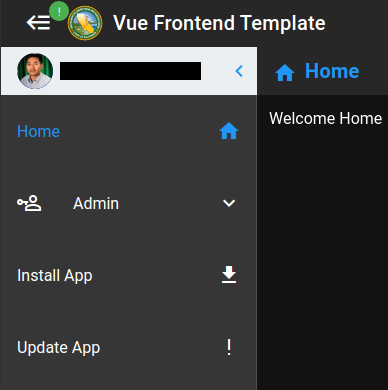

# Progressive Web Application

:::tip
All projects forked from `vue-frontend-template` is a PWA application!
:::

PWAs allow us to be installed on a users device, whether it'd a phone, tablet, or desktop.
When running as a PWA it **behaves like a native app** on their phone.

## Application Install

### Installing the App



This option `Install App` is available in the left navigation drawer.
This goes away when they have installed the app and have it running.

### Accessing the PWA

After install, the application it will show up on your desktop _(App Drawer for mobile users)_

## Application Updates

:::danger
Do **NOT** update the version in package.json manually!
:::

<center>



</center>

At the bottom left of the navigation drawer we display the application version `(from package.json)` and the git commit id `(auto-generated)`.

### How to update

#### npm version major | minor | patch

You can properly update your application `major`, `minor`, and `patch` releases with **npm** provided commands.

- This bumps up the version appropriate
- Creates a commit on your current branch with the version number
- Creates a tag _(No needed)_

* **Type:** `CLI`
* **Usage:**

```sh
# Assume we're currently on version 1.0.1

npm version major # Sets the version to v2.0.0
npm version minor # Sets the version to v1.1.0
npm version major # Sets the version to v1.0.2
```

### Update Notification

When you've updated your application and pushed out a release you'll see a notification at the top left corner of the app.



You can expand it to reveal the option `Update App` when ready.
_Updated are applied automatically once all instances are closed._


