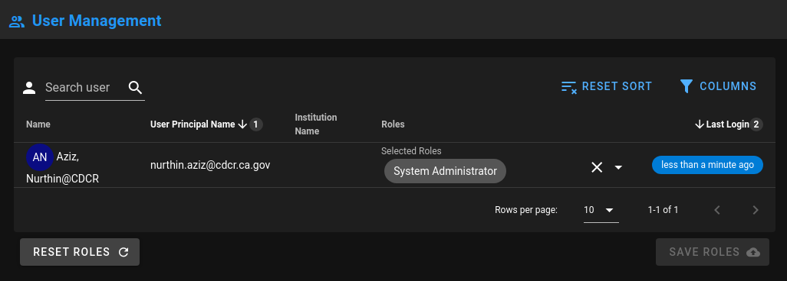
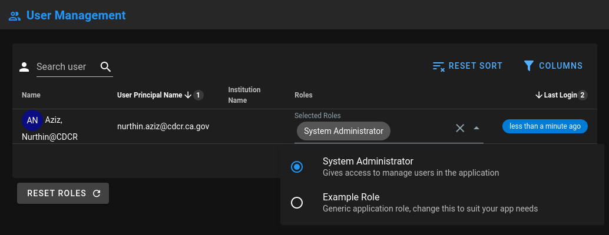

# User Management

The users management page is found at `@/views/Admin/Users.vue`
The route path for this page is `/admin/users`

## Assigning Roles

If you are the first user to ever log into the application you'll be given the default role `defaultAdminRole.name`.
This role is enough to get your in to the `/admin/users` path to assign roles to other users.

Visiting this page will display a table with a list of users like below:


Selecting the dropdown under the `Roles` will reveal the defined `roles` found in `myApp.js`


## Defining Roles

### Defining the Default Admin Role

The default admin role is defined as `System Administrator`.

This can be changed to suit your applications verbiage via `myApp.js`

```js
// TODO: Define a default role for the first logged in user.
const defaultAdminRole = {
  name: 'System Administrator',
  description: 'Gives access to manage users in the application',
  priority: 1, // Default: 1 - Highest priority level
};
```

The same information can also be found [here](/config/#defaultadminrole).

### Defining a User Role

Defining other app user roles is as simple as adding it to the `approles` array in `myApp.js`.

We can expand upon like so:

```js
// Add your application role to the array
const myRole = {
  name: String,
  description: String,
  priority: Number, // Default: 1 - Highest priority level; NOTE: Cannot assign roles of a higher priority level than your own
}

var myApp = Object.freeze({
  ...
  approles: [
    myRole,
    defaultAdminRole,
    {
      name: 'Example Role',
      description:
        'Generic application role, change this to suit your app needs',
      priority: 999,
    },
  ]
});
```

## Store Helpers

### getAppUserRoles

- **Type:** `Function`
- **Return:** `Array`
- **Location:** `@/store/modules/users.js`
- **Usage:**

```js
const appUserRoles = store.getters['users/getAppUserRoles']; // Grab the roles from the loggedInUser

appUserRoles.forEach((role) => {
  console.log({ role });
});
```

### isUserLoggedIn

- **Type:** `Function`
- **Return:** `Boolean`
- **Location:** `@/store/modules/users.js`
- **Usage:**

```js
const isUserLogged = this.$store.getters['users/isUserLoggedIn'];

if (isUserLogged) {
  console.log('User is logged in');
} else {
  console.log('User is not logged in!');
}
```

### loggedInUser

Returns the currently logged in user.

- **Type:** `Function`
- **Return:** `Object`
- **Location:** `@/store/modules/users.js`
- **Usage:**

```js
const loggedInUser = this.$store.get('users/loggedInUser');

console.log('loggedInUser: ', loggedInUser);
```
