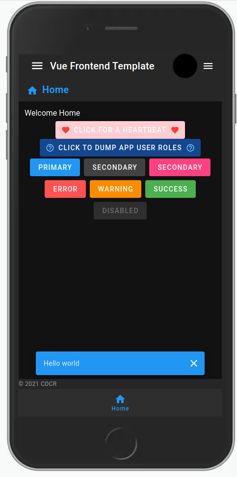
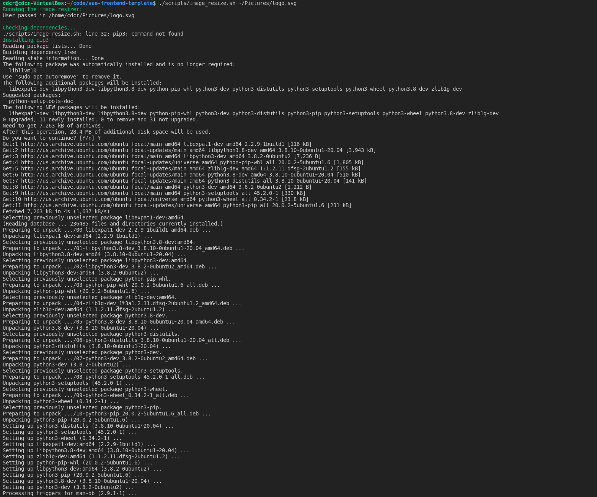
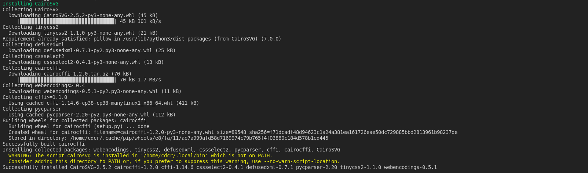
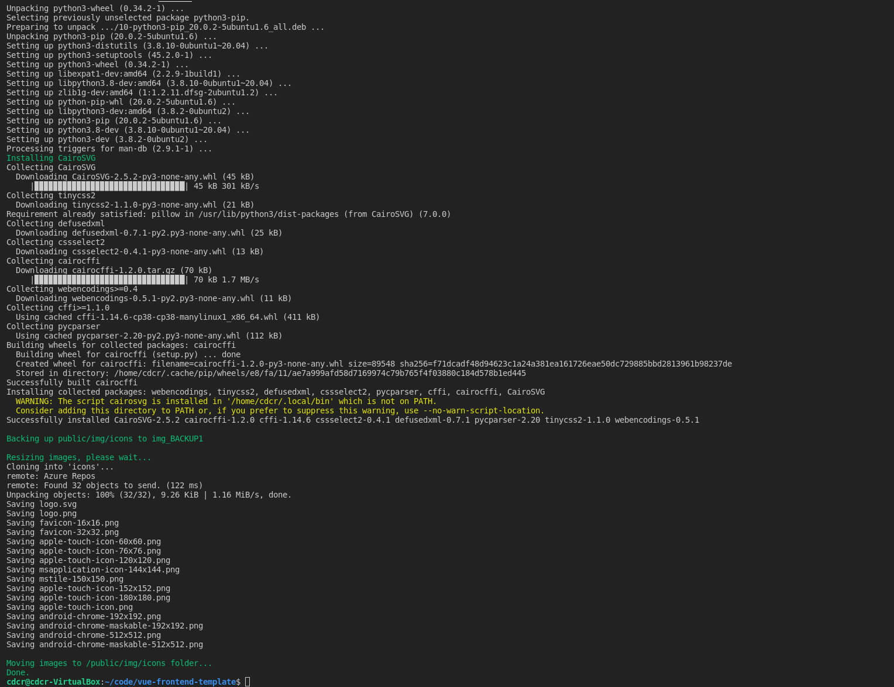
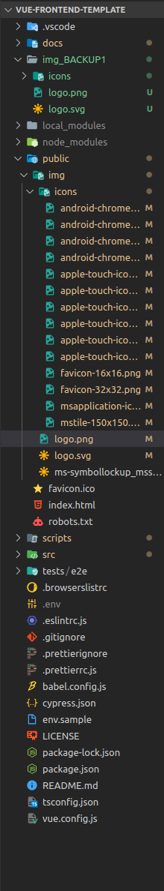
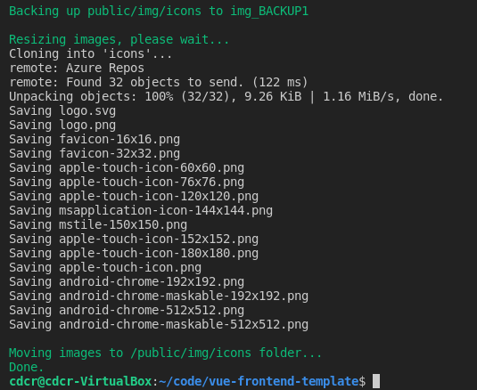

# Utilities

## SET_SNACKBAR

This helper pops up a snackbar at the position specified in the options.
This snackbar automatically goes away after 6 seconds.



- **Type:** `Function`
- **Param:** `Object`
- **Location:** `@/store/modules/app.js`
- **Usage:**

```js
import { call } from "vuex-pathify";

export default {
  methods: {
    ...call("app", ["SET_SNACKBAR"])
    /**
     * toggleSnackbar
     * Uses the alert state from app module to set an alert for the App handle passed to the util Alert.vue
     *
     * @param {Object} options - The alert options with message being the only required
     */
    toggleSnackbar(message) {
      const options = {
        icon: 'mdi-account',
        color: 'info',
        message: message,
        bottom: true,
      };
      this.SET_SNACKBAR(options);
    }
  }
}
```

## SET_ALERT

This helper pops up an alert message with the option to add an onClick even through a button.


- **Type:** `Function`
- **Param:** `Object`
- **Location:** `@/store/modules/app.js`
- **Usage:**

```js
import { call } from "vuex-pathify";

export default {
  methods: {
    ...call("app", ["SET_ALERT"])
  /**
   * toggleAlert
   * Uses the alert state from app module to set an alert for the App handle passed to the util Alert.vue
   *
   * @param {Object} options - The alert options with message being the only required
   */
    toggleAlert(message) {
      const options = {
        type: 'success',
        message: message,
        button: 'Click Me',
        onClick: () => {
          alert('Roll for initative!');
        },
      };
      this.SET_ALERT(options);
    }
  }
}
```

## image_resize.sh

Passing in a `.png` or a `.svg` will generate the appropriate images sizes for PWA install.
A backup is made, in case you need to revert the changes.

Once the script is completed all the default images for PWA in the `/public/img` folders will be replaced with the one we passed in.

- **Type:** `script`
- **Param:** `.PNG or .SVG file`
- **Location:** `/scripts/image_resize.sh`
- **Usage:**

```sh
./scripts/image_resize.sh ~/Documents/Icons/logo.png
```

### Output

When you run the script for the first time it may prompt you to install some dependencies. That's OK!
We need them to do all the image resizes, the **two** dependencies we have are `pip3`, and `cairosvg`.





After the script is complete you'll see the files have been backed up and updated appropriately.




## `npm run merge-squash`

You can run the following command to perform a merge of all your working changes onto main.

```sh
npm run merge-squash
```

## Export all helpers within a folder

**If** your "helpers-like" folder is similar to below:

```sh
./src/helpers/
├── hasAllRoles.js
├── hasAnyRoles.js
├── hasARole.js
├── hexAddition.js
├── index.js
├── roleCheck.js
├── showApiVersion.js
├── stringToColor.js
└── toTitleCase.js
```

**and** you want to easily do the following:

```javascript
import { hasAllRoles } from '@/helpers/index.js';
```

**then** follow these steps:

In the the root of a the `/config/private/helpers` folder is a file called `index.js`

1. Save a copy of the `BoilerPlate` in this file as the `index.js` to any of your "helpers-like" folder.
2. All files within that folder will `export default` at a minimum. "SEE EXAMPLE FILE" below.

```javascript
const helloWorld = function () {
  console.log('Hello World!');
};
const helloEarthling = function () {
  console.log('Hello Earthling');
};
export { helloWorld, helloEarthling };
export default helloWorld;
```

3. The end result can be seen in the "EXAMPLE USAGE" below

```vue
<script>
  import { helloWorld, getHeartBeat, getDropdownLists } from '@/apis/index.js';
  import { helloEarthling } from '@/apis/helloWorld.js';
  export default {
    mounted() {
      helloWorld();
      helloEarthling();
    },
  };
</script>
```

### BoilerPlate

::: details
<<< @/../src/config/private/helpers/index.js#BoilerPlate
:::
